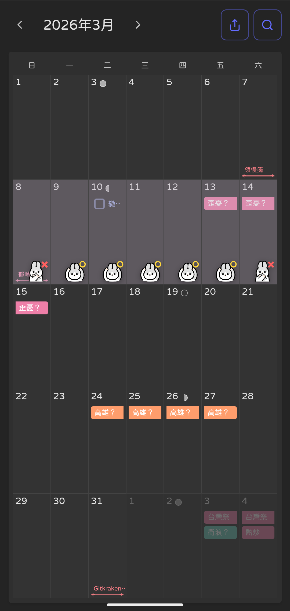
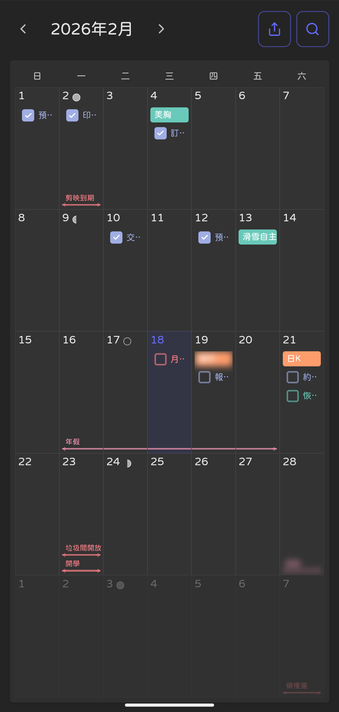

# TimeBlock Reader

一個基於 Vite + Vue 3 + TypeScript 的行事曆應用，用於讀取和顯示外部應用匯出的 SQLite 資料庫檔案中的時間區塊資料。

## 預覽畫面

|  |  |
|--------|--------|
|  |  |

## 功能特色

- 📅 **自訂行事曆視圖**：不使用現成元件，完全自訂的行事曆 UI
- 📁 **資料庫檔案上傳**：支援上傳 SQLite `.db` 檔案
- 🔍 **搜尋功能**：搜尋事件標題、內容、地點，點擊結果跳轉到對應月份
- 🔗 **行事曆分享**：一鍵產生分享連結，壓縮資料放入URL，無需上傳db檔案即可查看
- ✏️ **欄位編輯**：支援編輯事件標題和描述，即時更新
- 🎨 **多種事件類型**：
  - 活動（type: 0）- 色塊顯示，連續日期自動連接
  - 任務（type: 2）- 圓角矩形 checkbox + 文字，已完成顯示打勾
  - 備忘（type: 3）- 色塊顯示
  - 區間（type: 4）- 橫跨多個日期的雙向箭頭線
  - 習慣（type: 5）- 圓形 checkbox + 文字
- 🎨 **顏色支援**：根據資料庫中的 color 欄位顯示對應顏色（背景、線條、邊框）
- ✅ **任務完成狀態**：已完成任務顯示打勾checkbox，保持原始顏色
- 📝 **事件詳情彈窗**：點擊事件查看詳細資訊（標題、內容、地點、時間範圍）
- 🏷️ **日期標記**：為日期添加半透明遮罩、標記文字和貼圖
- 🔒 **隱私保護**：支援模糊事件文字，便於截圖分享；分享連結中隱私事件保持模糊狀態
- 📅 **月份導航**：上一月/下一月切換，點擊年月跳轉到今天
- 🎭 **貼圖系統**：三組貼圖可選，支援APNG動態貼圖自動重播
- ⏰ **時間顯示優化**：同一天的事件只顯示一次日期
- 📱 **響應式設計**：支援桌面、平板、手機等多種螢幕尺寸
- 🌓 **主題支援**：自動適配淺色/深色主題
- 🌙 **農曆行事曆**：每個日期儲存格右上角顯示準確的台灣農曆日期，特殊日期（初一、初八、十五、二十二）使用圖示顯示
- 🎨 **自訂字體**：支援切換字體集（粉圓體、全瀨體），字體偏好自動儲存
- 🎮 **動態載入提示**：檔案上傳時顯示遊戲風格的打字機效果和狀態指示器
- 🔗 **分享模式優化**：分享連結中隱藏編輯和分享按鈕，停用日期標記功能，隱私事件不可點擊
- 📅 **日期彈窗優化**：日期彈窗標題顯示具體日期（如"2026/02/09"），事件描述保留換行格式
- 🔒 **隱私事件標識**：事件列表中的隱私事件在右側顯示隱私圖示，清晰標識隱私狀態
- 🎯 **多層彈窗互動**：點擊日期後再點擊事件時，日期彈窗保持打開，事件詳情以第二層彈窗顯示
- 📱 **行動端優化**：遮罩貼圖在手機上自動調整大小，防止超出邊界
- 📋 **智慧事件排序**：任務和習慣在活動之後顯示，避免跨日活動被任務打斷
- 📊 **動態顯示數量**：根據螢幕尺寸自動調整事件顯示數量，充分利用垂直空間
- 🔀 **區間重疊處理**：重疊的區間自動上下排列，清晰顯示所有區間
- 📅 **彈窗格式優化**：日期標題使用 YYYY/MM/DD 格式，任務和區間全天事件不顯示"全天"

## 技術棧

- **Vue 3** - 漸進式 JavaScript 框架
- **TypeScript** - 型別安全的 JavaScript
- **Vite** - 下一代前端建置工具
- **sql.js** - 在瀏覽器中執行 SQLite
- **pako** - Gzip壓縮庫（用於分享功能）
- **lunar-javascript** - 農曆日期轉換庫（用於顯示台灣農曆）

## 專案結構

```
timeblock-reader/
├── src/
│   ├── components/
│   │   ├── Calendar.vue      # 行事曆主元件
│   │   ├── FileUpload.vue   # 檔案上傳元件
│   │   └── EventModal.vue    # 事件詳情和日期標記彈窗
│   ├── utils/
│   │   ├── dbReader.ts      # 資料庫讀取工具
│   │   ├── shareEncoder.ts  # 行事曆分享編碼/解碼工具
│   │   ├── lunarCalendar.ts # 農曆日期轉換工具
│   │   ├── fontManager.ts   # 字體切換管理工具
│   │   ├── dateFormatter.ts # 日期/時間格式化工具
│   │   ├── eventUtils.ts    # 事件類型檢查工具
│   │   ├── apngManager.ts   # APNG 圖片自動重播管理器
│   │   └── constants.ts     # 應用常數定義
│   ├── assets/
│   │   └── fonts/           # 自訂字體檔案
│   ├── types/
│   │   └── lunar-javascript.d.ts  # 農曆庫型別宣告
│   ├── App.vue               # 根元件
│   ├── main.ts               # 入口檔案
│   └── style.css             # 全域樣式
├── doc/
│   ├── MAINTENANCE_LOG.md    # 維護日誌
│   └── CODE_OPTIMIZATION_REPORT.md  # 程式碼優化報告
├── screenshots/               # 預覽截圖
├── index.html                # HTML 入口
└── package.json              # 專案設定
```

## 安裝與執行

### 安裝相依套件

```bash
npm install
```

### 開發模式

```bash
npm run dev
```

### 建置生產版本

```bash
npm run build
```

### 預覽生產版本

```bash
npm run preview
```

## 使用方式

1. 啟動開發伺服器後，在瀏覽器中開啟應用
2. 點擊上傳按鈕，選擇要讀取的 SQLite `.db` 檔案
3. 應用會自動讀取 `timeblock` 資料表中的資料
4. 行事曆會顯示所有事件，不同類型的事件有不同的顯示樣式
5. **搜尋事件**：點擊右上角搜尋圖示，輸入關鍵詞搜尋事件
6. **分享行事曆**：點擊分享按鈕，產生分享連結，複製後分享給他人
7. **開啟分享連結**：直接開啟分享連結，無需上傳db檔案即可查看行事曆
8. **編輯事件**：點擊事件開啟詳情彈窗，點擊編輯圖示編輯標題或描述
9. **查看詳情**：點擊事件或日期空白處開啟詳情彈窗
10. **日期標記**：在日期彈窗中設定遮罩、文字、貼圖（僅限非分享模式）
11. **保護隱私**：點擊"設為隱私"按鈕模糊事件文字；隱私事件在分享連結中保持模糊且不可點擊；事件列表中的隱私事件顯示隱私圖示
12. **切換月份**：使用左右箭頭或點擊年月標題切換月份
13. **查看農曆**：每個日期儲存格右上角顯示農曆日期
14. **切換字體**：使用字體管理器切換字體集（字體偏好自動儲存）
15. **分享模式**：從分享連結開啟時，自動隱藏編輯和分享功能，僅可查看
16. **日期事件列表**：點擊日期空白處查看該日期的所有事件列表，點擊事件查看詳情（日期彈窗保持打開）
17. **事件描述換行**：事件描述保留原始換行格式，完整顯示多行內容

## 資料庫表結構

應用讀取 `timeblock` 資料表中的以下欄位：

- `_id`: 記錄 ID
- `uid`: 唯一識別碼
- `type`: 類型（0: 活動, 2: 任務, 3: 備忘, 4: 區間, 5: 習慣）
- `title`: 事件標題
- `color`: 顏色代碼（數字）
- `location`: 地址
- `description`: 描述
- `allday`: 是否全天事件
- `dt_start`: 開始時間戳
- `dt_end`: 結束時間戳
- `dt_done`: 完成時間戳
- `dt_delete`: 刪除時間戳

## 開發說明

詳細的開發歷程和功能實作記錄請查看 [維護日誌](./doc/MAINTENANCE_LOG.md)。

## License

MIT
